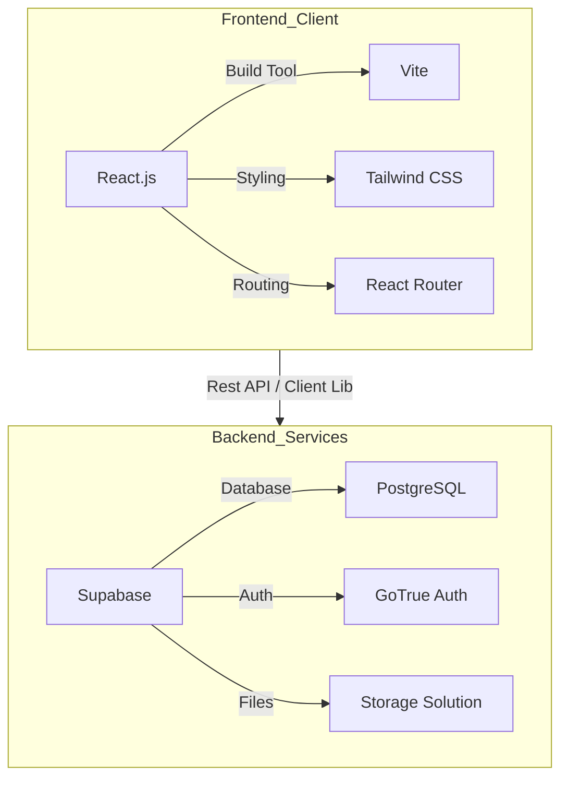
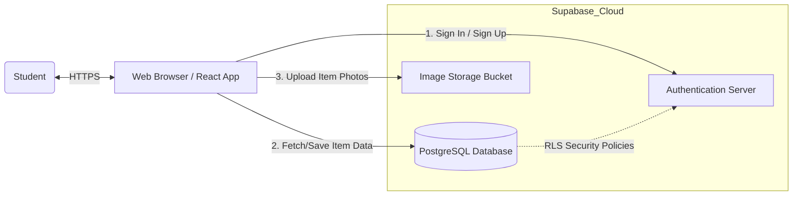
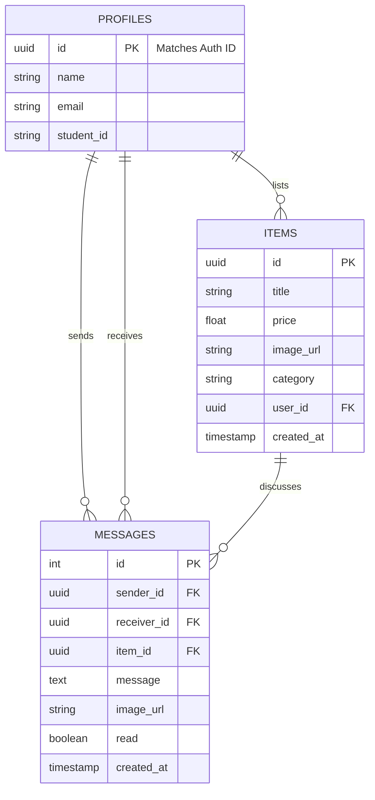
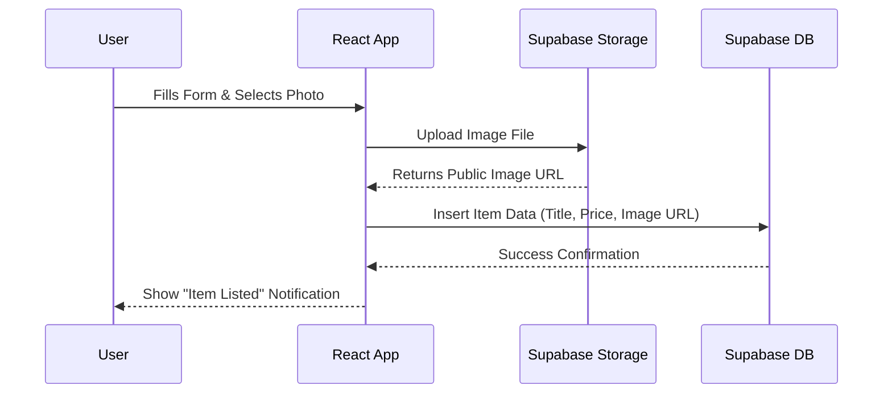

# Campus Trade - Viva Master Guide

This document is structured exactly according to your requested presentation flow. It includes **visual diagrams** (using Mermaid syntax) which you can render in VS Code or online tools (like [Mermaid Live](https://mermaid.live/)) to put into your slides.

---

## 1. Introduction

"Good morning/afternoon. Today I am presenting **Campus Trade**, a centralized marketplace application dealing with the specific needs of university students."

- **Hook**: Buying and selling items on campus is currently chaotic (WhatsApp groups, notice boards). This app solves that.

## 2. Project Overview

- **Name**: Campus Trade
- **Type**: Single Page Application (SPA) / E-commerce Platform.
- **Core Concept**: A peer-to-peer (P2P) marketplace where students can list used items (textbooks, electronics) and others can connect with them to buy.

## 3. Objectives

1.  **Simplify Trading**: Create a unified platform replacing scattered social media groups.
2.  **Safety**: Ensure users are students (via authentication) to reduce scam risks.
3.  **User Experience**: Provide a modern, mobile-friendly interface for easy browsing and listing.

## 4. Technology Stack (Visualized)

Instead of just listing them, show how they fit together:

## 5. System Architecture

This diagram explains **how** the system works to the lecturer. It shows the flow of data.

- **Explanation**: The user interacts with the React App. The app talks directly to Supabase services. We don't have a middle "Node.js" server because Supabase acts as the backend api.

## 6. Database Design

A simple ER (Entity-Relationship) Diagram showing how your data connects.

- **Profiles Table**: Stores user info.
- **Items Table**: Stores the products.
- **Relation**: One Profile can list **Many** Items (1-to-Maybe relationship).

## 7. Features & Functionalities

### Core Features:

1.  **User Authentication**: Secure Sign-up/Login using Email/OTP.
2.  **Marketplace Feed**: Filter by Category, Search by Name, Sort by Price/Newest.
3.  **Selling items**: Image upload and data entry from verified users.
4.  **Real-time Chat**: Integrated instant messaging to negotiate prices and meetups directly.

### Visual Workflow: "Selling an Item"

## 8. Security Considerations

- **Row Level Security (RLS)**: This is crucial. It means even if hackers access the API, they can't delete other people's items. Database rules imply "You can only edit rows where `user_id` = `your_id`".
- **Protected Routes**: In React, we check if a user is valid before letting them visit `/sell`.
- **Input Validation**: We check file sizes (images < 10MB) and ensure required fields are filled.

## 9. Challenges & Solutions

| Challenge            | Solution                                                                                                                             |
| :------------------- | :----------------------------------------------------------------------------------------------------------------------------------- |
| **State Management** | Used `useContext` (Context API) to share User Auth state globally to avoid "prop drilling".                                          |
| **Image Hosting**    | Handling file uploads on a custom server is hard, so I utilized **Supabase Storage**buckets which handle file serving automatically. |
| **Performance**      | Used **Vite** for fast bundling and **Tailwind** for minimal CSS file size.                                                          |

## 10. Future Enhancements

1.  **Payment Gateway**: Allow students to pay directly on the app (Stripe/PayPal).
2.  **Notification System**: Push notifications for new messages or item updates.
3.  **review System**: Allow buyers to rate sellers.

## 11. Conclusion

"Campus Trade successfully modernizes the way students exchange goods. It is built on a scalable, modern tech stack (React + Supabase) that ensures speed, security, and ease of use. It is ready for future expansion into payments and more advanced social features."

## 12. Viva Questions (Preparation)

**Q: Can you explain the Data Flow in your diagram?**
_A: "Yes. The React frontend makes asynchronous calls to Supabase. When a user logs in, Supabase returns a session token (JWT). This token is sent with every subsequent request (like fetching items) to prove identity."_

**Q: Why is your database design simple?**
_A: "For this MVP (Minimum Viable Product), we prioritized the core interaction: User -> Item. As the app grows, we can add tables for 'Orders' or 'Chats', but strictly speaking, they aren't needed just to list and view items."_

**Q: How does the filtering work?**
_A: "We use Supabase query modifiers. For example `.eq('category', 'Books')` translates to a SQL `WHERE category = 'Books'`. This happens on the database side, so it's very fast, rather than filtering 10,000 items in the browser."_
